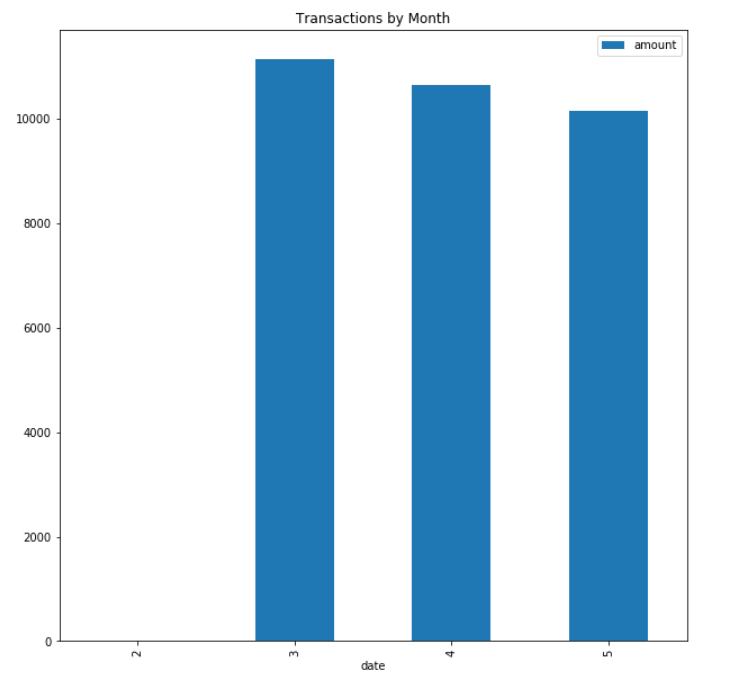

# Retirment Analysis Using APIs
This document summarizes our assumptions and findings for retirement planning. Plaid and Alpaca APIs were used as the data sources. 

---

## Assumptions

* The transaction sample data was for the 90 day period from 2/28/2020 to 5/25/2020 sourced from Plaid.

* Portfolio performance for Monte Carlo simulations is based on 1 year's worth of daily returns from 2019. Stock performance is based on SPY and bond performance is based on AGG sourced from Alpaca. The combined portfolio assumes a 60/40 weighting of stocks to bonds.

* 500 Monte Carlo simulations were run for a 30 year period of returns.

---

## Findings

The following income and spending data was provided by Plaid:
### Income
* The previous year's gross income was $7,285.
* Current monthly income is $500.
* The projected yearly income is $7,389.
### Expenses by Category
* Food and Drink:   $3,317.19
* Payment:          $6,310.50
* Recreation:        $235.50
* Shops:            $1,500.00
* Transfer:        $20,537.34
* Travel:             $35.19

### Spending by Month

* Feb	$6.33
* Mar	$11,145.24
* Apr	$10,645.24
* May	$10,138.91

---

## Retirement Analysis

Running 500 Monte Carlo simulations produced the following range of cumulative returns.

With a 90% confidence interval cumulative returns will fall between 34.5 and 92.2 (red lines on histogram).

* The expected cumulative return for the 10th percentile is 41.26.
* The expected cumulative return for the 50th percentile is 57.73.
* The expected cumulative return for the 90th percentile is 82.33.

With an initial investment of $20,000:
* The expected portfolio return for the 10th percentile is $825,239.96
* The expected portfolio return for the 50th percentile is $1,154,682.34
* The expected portfolio return for the 90th percentile is $1,646,669.40

Given the current projected annual income of $7,389, a 4% withdrawal rate from the retirement portfolio at the 10th percentile is sufficient.